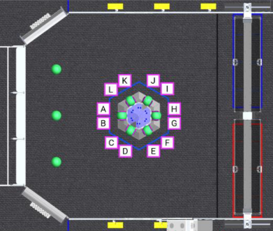
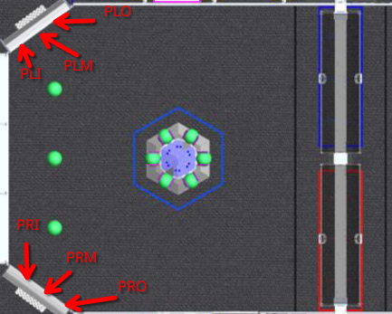
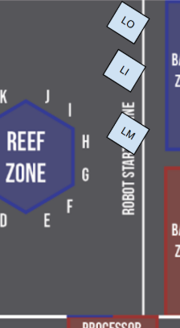
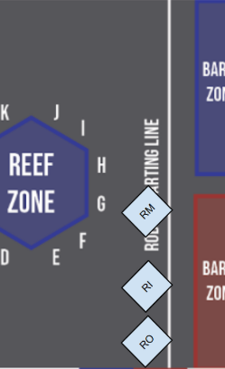

# Field Locations

This document is a reference for names for different locations on the field.
These names should be used for naming auto paths and other tasks which require referring to field locations.

## Reef locations

Each scoring location on the reef should be identified by the letter shown in the diagram above.
If there is ambiguity about what the letter refers to, it may be notated as ReefN where N is the letter for that location on the reef.

## Coral Station Locations

There are three named locations per coral station.
These correspond to the inside, middle, and outside "lanes" of the station.
The goal of the distinction is to be able to adjust our pickup locations to avoid congestion.

Each location is named "P" + {Right = "R", Left = "L"} + {Outside = "O", Middle = "M", Inside = "I"}

## Starting Locations

There are three starting locations per side that correspond to the inside, middle, and outside.

Each location is named {Right = "R", Left = "L"} + {Outside = "O", Middle = "M", Inside = "I"}

