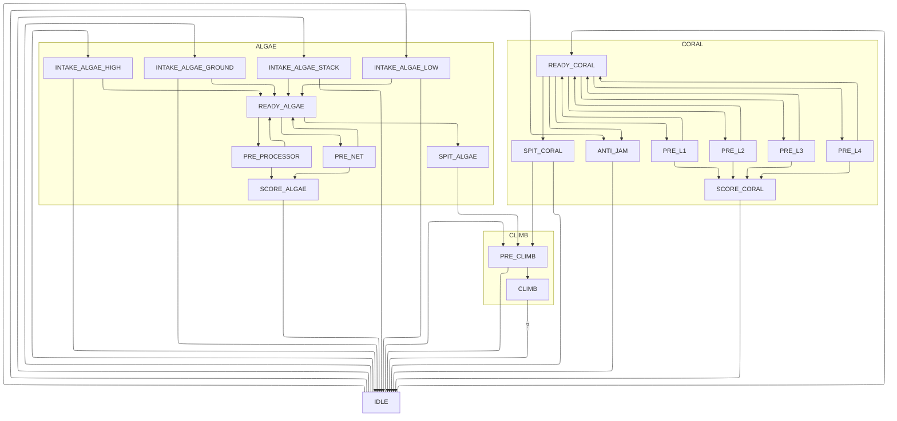

# Superstructure Graph

## Descriptions

| State | Description | End |
| ----- | ----------- | --- |
| IDLE  | The robot has no game pieces, the elevator, intake, and manipulators are in position to intake from the human player station, and the relevant rollers are running. | An intake or climb request is triggered. |
| READY_CORAL | The robot has a coral in the manipulator. The elevator, intake, and manipulator are retracted. | A scoring, prescoring, or spit request is triggered. |
| SPIT_CORAL | The robot ejects a piece of coral from the manipulator onto the ground. | No game piece is detected and a timer passes. |
| PRE_{L1-4} | Move the manipulator and elevator to the corresponding position in preparation for scoring. | The manipulator and elevator are in the correct position, the score request is triggered, and the drivebase is in the right location (if pose est is good enough to validate this). |
| SCORE_CORAL | The robot holds the manipulator and elevator in their position and ejects a held coral. | No coral is detected in the robot and/or a timer times out. |
| ANTI_JAM | The robot extends the intake and elevator to clear the center of the robot to help remove coral that may be stuck. | The corresponding request ends. |
| INTAKE_ALGAE_{Location} | The robot moves the manipulator and elevator to the relevant position and runs the manipulator to intake algae. | When the request ends or an algae is detected in the manipulator. |
| READY_ALGAE | The robot has an algae in the manipulator. The elevator, intake, and manipulator are retracted. | A scoring, prescoring, or spit request is triggered. |
| SPIT_ALGAE | The robot ejects an algae from the manipulator onto the ground. | No game piece is detected and a timer passes. |
| PRE_PROCESSOR | Move the manipulator and elevator to the corresponding position in preparation for scoring. | The manipulator and elevator are in the correct position, the score request is triggered, and the drivebase is in the right location (if pose est is good enough to validate this). |
| PRE_NET | Move the manipulator and elevator to the corresponding position in preparation for scoring. | The manipulator and elevator are in the correct position, the score request is triggered, and the drivebase is in the right location (if pose est is good enough to validate this). |
| SCORE_ALGAE | The robot holds the manipulator and elevator in their position and ejects a held algae. | No algae is detected in the robot and/or a timer times out. |
| PRE_CLIMB | The robot extends the climber and intake and runs any motion required to latch onto the cage. | When the robot grabs the cage and a relevant request is triggered. |
| CLIMB | The robot winches in the climber. | A relevant cancel request is run, although this may be dangerous if the climb latch is one-way. |
