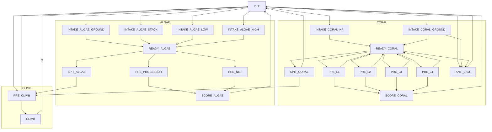

# Superstructure Graph

```mermaid
%%{ init: { 'flowchart': { 'curve': 'linear' } } }%%
graph TD;

IDLE

IDLE --> INTAKE_CORAL_HP
IDLE --> INTAKE_CORAL_GROUND
SCORE_CORAL --> IDLE
SPIT_CORAL --> IDLE

subgraph CORAL

INTAKE_CORAL_HP
INTAKE_CORAL_GROUND
INTAKE_CORAL_HP --> READY_CORAL
INTAKE_CORAL_GROUND --> READY_CORAL

READY_CORAL --> SPIT_CORAL

READY_CORAL --> PRE_L1
READY_CORAL --> PRE_L2
READY_CORAL --> PRE_L3
READY_CORAL --> PRE_L4

SCORE_CORAL
PRE_L1 --> SCORE_CORAL
PRE_L2 --> SCORE_CORAL
PRE_L3 --> SCORE_CORAL
PRE_L4 --> SCORE_CORAL

PRE_L1 --> READY_CORAL
PRE_L2 --> READY_CORAL
PRE_L3 --> READY_CORAL
PRE_L4 --> READY_CORAL

ANTI_JAM

end

IDLE --> INTAKE_ALGAE_GROUND
IDLE --> INTAKE_ALGAE_STACK
IDLE --> INTAKE_ALGAE_LOW
IDLE --> INTAKE_ALGAE_HIGH

SCORE_ALGAE --> IDLE

subgraph ALGAE

INTAKE_ALGAE_GROUND --> READY_ALGAE
INTAKE_ALGAE_STACK --> READY_ALGAE
INTAKE_ALGAE_LOW --> READY_ALGAE
INTAKE_ALGAE_HIGH --> READY_ALGAE

READY_ALGAE --> SPIT_ALGAE
READY_ALGAE --> PRE_PROCESSOR
READY_ALGAE --> PRE_NET

PRE_PROCESSOR --> SCORE_ALGAE
PRE_NET --> SCORE_ALGAE

end

IDLE --> ANTI_JAM
ANTI_JAM --> IDLE
INTAKE_CORAL_GROUND --> ANTI_JAM
READY_CORAL --> ANTI_JAM

IDLE --> PRE_CLIMB
PRE_CLIMB --> IDLE
CLIMB --"?"--> IDLE

subgraph climb [CLIMB]

SPIT_CORAL --> PRE_CLIMB
SPIT_ALGAE --> PRE_CLIMB
PRE_CLIMB --> CLIMB

end
```
